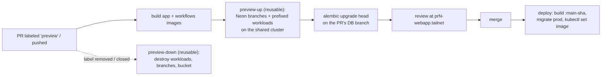

# lab-platform template app

A hello-world consumer of
[terraform-aws-lab-platform](https://github.com/your-org/terraform-aws-lab-platform):
a `uv` workspace with a database, a webapp, and a Dagster pipeline, plus CI
that gives every pull request its **own preview environment** — branched
database included — and deploys `main` to prod. Every piece is deliberately
tiny; the value is the wiring.

Use it as a GitHub template ("Use this template"), then follow
[Adopt this template](#adopt-this-template).

## The loop



- **Previews** (`.github/workflows/preview-up.yml`): a PR labeled `preview`
  gets a Terraform workspace of [`infra/preview`](infra/preview/) stamped
  `pr<N>-`: the PR's images serve the webapp and the Dagster code location,
  against copy-on-write Neon branches of prod data. The PR's own migrations
  run on the PR's own branch — schema experiments never touch prod. The label
  is the gate, so most PRs deploy nothing.
- **Teardown** (`preview-down.yml` + nightly `sweep.yml`): removing the label
  or closing the PR destroys everything — a preview can be parked while its
  PR stays open — and the sweep catches anything that slips through.
- **Deploy** (`deploy.yml`): on `main`, migrate the prod database
  (expand-contract: the old revision keeps running during the rollout), then
  `kubectl set image`. The prod stack sets `webapp_ignore_image_changes = true`
  so CI owns the running tag and `tofu apply` never fights it.

## Layout

| Path | What |
| --- | --- |
| `packages/db` | SQLAlchemy models, engine helper, Alembic migrations (the schema) |
| `packages/app` | FastAPI webapp: `/` reads the DB, `/healthz` never does, marimo notebook at `/notebooks/`, tailnet identity at `/whoami` |
| `packages/workflows` | Dagster assets/jobs/schedule/sensor: Ray fan-out + streaming micro-batch examples |
| `deployables.json` | The deployables (single source of truth for CI's build matrix and `infra/preview`) |
| `infra/preview` | This app's per-PR preview stack (platform modules, remote source) |
| `Dockerfile` | One shared recipe, per-package images via `TARGET_PACKAGE`; GPU via `BASE_IMAGE` + `--extra gpu` |
| `.github/workflows` | ci / preview-up / preview-down / sweep / deploy |

The workspace mirrors a production monorepo at hello-world scale: packages
stay dependency-light and import each other through the workspace
(`app -> db`, `workflows -> db[migrate]`), tests and lint run from the root,
and one lockfile pins everything including the image build.

## Run it locally

```shell
uv sync                  # everything, including dev tooling
uv run pytest            # 9 tests, no database or containers needed (sqlite + local Ray)
uv run ruff check .
uv run ty check

podman compose up --build   # postgres -> alembic upgrade head -> webapp
curl localhost:8080/                             # {"message":"Hello, world",...}
curl -X POST localhost:8080/greetings -H 'content-type: application/json' -d '{"name":"me"}'
open http://localhost:8080/notebooks/            # reactive marimo page over the same DB

uv run dagster dev -f packages/workflows/repo.py   # Dagster UI on :3000
```

Everything container-side is plain compose spec / OCI, so `docker compose`
works identically if that's what you have.

The app itself demonstrates **notebooks as app pages**: `/notebooks/` is a
[marimo](https://marimo.io) notebook served by the webapp in run mode —
visitors get the reactive UI (filter the greetings table live) but can't edit
or execute code. Analytical views cost a notebook, not a frontend. It ships
with no login gate because the platform serves the app tailnet-private;
reachability is the access control — add auth before exposing it publicly.

It also demonstrates **identity for free on the tailnet**: `/whoami` echoes
the `Tailscale-User-Login` header the platform's private ingress proxy asserts
on every request. Because the tailnet's login provider is your IdP (e.g.
Google), that header is a real per-user identity with no OAuth client, no
redirect URIs, and no session state — exactly what per-PR preview URLs want.
Build on it only where the proxy is the sole route to the pod, and scope who
can reach each service at the ACL with the workloads module's
`private_ingress_annotations` (per-service Tailscale device tags).

Two workflow patterns to try in the Dagster UI:

- **Fan-out over Ray** — `ray_fanout_job` materializes `ray_fanned_greetings`:
  Dagster orchestrates, Ray fans eight tasks out (locally when `RAY_ADDRESS`
  is unset, across your Ray cluster when set, e.g.
  `ray://<prefix>kuberay-head-svc.ray.svc:10001`), and the results are written
  back to the database in one place. Ray client connections require the
  cluster and this image to agree on Ray and Python *minor* versions — this
  repo is on Python 3.14, so point the platform's `ray_image_tag` at a
  matching `-py314` image (or pin this repo to the cluster's Python). The
  version-proof approach: build the workflows image FROM the cluster's own
  base (`BASE_IMAGE=rayproject/ray:<ray_version>-py314`), and both match by
  construction.
- **Streaming (micro-batch)** — toggle `greeting_stream_sensor` on, then
  `curl -X POST localhost:8080/greetings ...` a few times: within a tick the
  sensor's cursor notices the new rows and launches `stream_digest_job` for
  exactly that id window. Cursor sensors emitting micro-batch runs are
  Dagster's idiom for streaming sources (a Kafka topic or S3 prefix slots into
  the same shape: poll offsets in the sensor, hand the window to the run).

## The image contract

One `Dockerfile`, parameterized by `TARGET_PACKAGE`, builds a slim image
per deployable from the same workspace and lockfile — the images reviewed in
the preview are what deploy:

| Image (`TARGET_PACKAGE`) | How it runs |
| --- | --- |
| `app` | default `CMD` — uvicorn on `:8080`, probes on `/healthz` (module defaults in `infra/preview`) |
| `workflows` | the Dagster chart injects `dagster api grpc --python-file /opt/dagster/app/repo.py` (`dagster_user_code_image`) |
| `workflows` (again) | migrations: `alembic -c packages/db/alembic.ini upgrade head` — it carries `db[migrate]` |

`/healthz` deliberately skips the database: preview pods become Ready before
the migrate job has run, and `/` starts answering the moment the branch is
migrated.

### Adding a deployable

`deployables.json` is the single source of truth; to add `app2`:

1. Create `packages/app2` (a normal workspace member) and add `"app2"` to
   `deployables.json` — CI now builds/pushes `app2-<stamp>` images and
   `infra/preview` gets `local.image["app2"]` for free.
2. Wire it into `infra/preview/main.tf` — a second webapp is a second thin
   `module "workloads"` block with only `enable_webapp = true`, a distinct
   `webapp_app_name`, and `webapp_image = local.image["app2"]`; a second
   Dagster *code location* instead shares the one Dagster instance.
3. Optionally add a compose service for local runs.

The shared recipe covers packages that differ only in dependencies. If a
package needs a genuinely different recipe (system libraries, another base),
give it its own `packages/<name>/Dockerfile` — CI prefers it over the root
one automatically.

### GPU builds

`packages/workflows` has a `gpu` extra (torch as the stand-in — swap in your
real GPU stack). It is never installed by default; a GPU image is an ordinary
build with a CUDA base (uv provisions the pinned Python itself, so any base
works):

```shell
podman build \
  --build-arg TARGET_PACKAGE=workflows \
  --build-arg BASE_IMAGE=nvidia/cuda:12.8.1-runtime-ubuntu24.04 \
  --build-arg EXTRA_DEPENDENCIES="--extra gpu" \
  --build-arg GPU_DEPENDENCIES="torch" \
  -t workflows:gpu .
```

`GPU_DEPENDENCIES` names the heavy wheels: a dedicated layer installs them at
the exact versions pinned in `uv.lock`, so it only rebuilds when those pins
change — not on every lockfile edit. The platform's `examples/complete`
already runs GPU nodes (NVIDIA GPU Operator + a tainted g5/g6 Karpenter
NodePool); pods just add the `nvidia.com/gpu` toleration and resource limit.

## Adopt this template

Prerequisites (once, from the platform repo): a shared cluster + Tailscale
operator (`examples/complete`), the bootstrap stack's CI/preview OIDC roles and
state bucket (`modules/bootstrap`), an ECR repository, and Neon projects for
`app` and `dagster`.

1. Find-and-replace `your-org` (workflow `uses:` lines, module sources, links),
   and pin `?ref=main` to a platform release tag.
2. Fill in `infra/preview/backend.tf` (state bucket/lock table) and
   `infra/preview/shared-platform.auto.tfvars` (cluster, VPC, Karpenter role,
   tailnet suffix, Neon parent branches).
3. Repository **variables**: `CI_ROLE_ARN`, `PREVIEW_ROLE_ARN`, `CLUSTER_NAME`,
   `AWS_REGION`, `ECR_REPOSITORY`.
4. Repository **secrets**: `NEON_API_KEY`, `TS_OAUTH_CLIENT_ID`,
   `TS_OAUTH_SECRET`, `PROD_DATABASE_URL`.
5. For `deploy.yml`: an EKS access entry granting `CI_ROLE_ARN` edit rights on
   the `webapp` and `dagster` namespaces, and a prod stack that enables the
   webapp with `webapp_ignore_image_changes = true`.
6. Create the `preview` repo label. Open a PR that adds a column and a
   migration, label it `preview` — watch it build, branch, migrate, and serve
   at `https://pr<N>-webapp.<tailnet>.ts.net`. Remove the label to tear the
   preview down without closing the PR.

## Costs

A preview is one small spot node (scales to zero when idle), Neon branches
(copy-on-write, ~free until written), an empty S3 bucket, and two tailnet
ingresses. The expensive things — cluster, NAT, operators — are shared and
already running.

## License

Apache-2.0, same as the platform repo.
