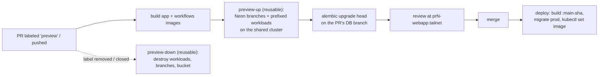
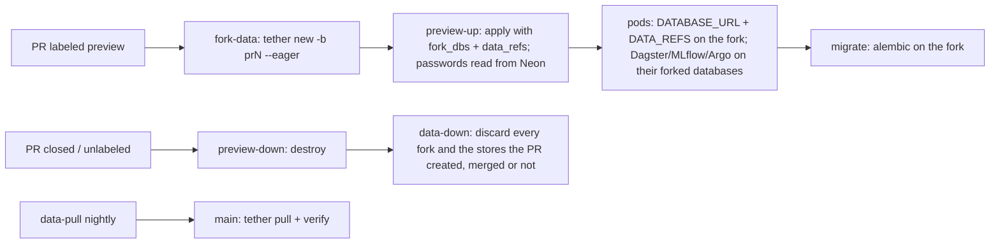

# lab-platform template app

A hello-world consumer of
[lab-platform](https://github.com/Rosebud-Biosciences/lab-platform):
a `uv` workspace with a database, a webapp, and a Dagster pipeline, plus CI
that gives every pull request its **own preview environment** — branched
database included — and deploys `main` to prod. Every piece is deliberately
tiny; the value is the wiring.

Use it as a GitHub template ("Use this template"), then follow
[Adopt this template](#adopt-this-template).

## The loop



- **Previews** (`.github/workflows/preview-up.yml`): a PR labeled `preview`
  gets a Terraform workspace of [`infra/preview`](infra/preview/) stamped
  `pr<N>-`: the PR's images serve the webapp and the Dagster code location,
  against copy-on-write Neon branches of prod data. The PR's own migrations
  run on the PR's own branch — schema experiments never touch prod. The label
  is the gate, so most PRs deploy nothing. It is not a security gate: a PR
  from a branch of this repository runs its own copy of the workflow, with
  the preview role. That role's IAM is fenced (its own path, a permissions
  boundary), but it deploys into the cluster as an admin, so grant write
  access to people you would give the cluster to (platform docs, "Trust").
  Add `preview:app-only` as well (before `preview`, or push a commit after)
  for a **frontend/API-only PR**: only the app image is built and stamped,
  still on its own database branch, and its `DAGSTER_WEBSERVER_URL` points at
  **prod's** Dagster. Up in about two minutes instead of ten — but runs the
  preview's app triggers then execute prod's code location on prod's data, so
  a pipeline or schema change in such a PR goes untested. The full/app choice
  and its consequences: platform docs, "Two preview profiles".
- **Teardown** (`preview-down.yml` + nightly `sweep.yml`): removing the label
  or closing the PR destroys everything — a preview can be parked while its
  PR stays open — and the sweep catches anything that slips through.
- **Deploy** (`deploy.yml`): on `main`, migrate the prod database
  (expand-contract: the old revision keeps running during the rollout), then
  `kubectl set image`. The prod stack sets `webapp_ignore_image_changes = true`
  so CI owns the running tag and `tofu apply` never fights it.

## Layout

| Path | What |
| --- | --- |
| `packages/db` | SQLAlchemy models, engine helper, Alembic migrations (the schema) |
| `packages/app` | FastAPI webapp: `/` reads the DB, `/healthz` never does, marimo notebook at `/notebooks/`, tailnet identity at `/whoami`, the data it is wired to at `/data` |
| `packages/dataset` | The app's [tether](https://github.com/elyall/tether) dataset as a package: `tether.toml` + one manifest per data object (Neon x2, Icechunk, Iceberg, Lance, Delta, an S3 prefix) next to the `DATA_REFS` contract (`refs.py`) and the native openers (`openers.py`, extra `[stores]`) |
| `packages/workflows` | Dagster assets/jobs/schedule/sensor: Ray fan-out + streaming micro-batch examples, plus one asset per data store (`stores.py`) through `dataset` |
| `deployables.json` | The deployables (single source of truth for CI's build matrix and `infra/preview`) |
| `infra/preview` | This app's per-PR preview stack (platform modules, remote source); `fork_provider` picks who forks the data |
| `Dockerfile` | One shared recipe, per-package images via `TARGET_PACKAGE`; GPU via `BASE_IMAGE` + `--extra gpu` |
| `.github/workflows` | ci / preview-up / preview-down / sweep / deploy, plus data-pull (nightly pins of prod data) and tether-matrix (tether's live backend test, off by default) |
| `.github/scripts` | The tether half of the preview loop: `tether-fork.sh`, `tether-down.sh`, `tether-open-all.sh`, `tether-matrix.sh` |

The workspace mirrors a production monorepo at hello-world scale: packages
stay dependency-light and import each other through the workspace
(`app -> db`, `workflows -> db[migrate]`), tests and lint run from the root,
and one lockfile pins everything including the image build.

## Run it locally

```shell
uv sync                  # everything, including dev tooling
uv run pytest            # 27 tests, no database, services or containers needed (sqlite + local Ray + local stores)
uv run ruff check .
uv run ty check

podman compose up --build   # postgres -> alembic upgrade head -> webapp
curl localhost:8080/                             # {"message":"Hello, world",...}
curl -X POST localhost:8080/greetings -H 'content-type: application/json' -d '{"name":"me"}'
open http://localhost:8080/notebooks/            # reactive marimo page over the same DB

uv run dagster dev -f packages/workflows/repo.py   # Dagster UI on :3000
```

Everything container-side is plain compose spec / OCI, so `docker compose`
works identically if that's what you have.

With no `DATA_REFS` set, the store assets (`data_stores_job` in the Dagster
UI) write to local stores under `.data/` (`DATA_ROOT` to move it) with a sqlite
Iceberg catalog: every backend in the matrix runs on a laptop, and
`cd packages/dataset && uv run tether status` works against the same
directory. See "Ephemeral data".

The app itself demonstrates **notebooks as app pages**: `/notebooks/` is a
[marimo](https://marimo.io) notebook served by the webapp in run mode —
visitors get the reactive UI (filter the greetings table live) but can't edit
or execute code. Analytical views cost a notebook, not a frontend. The page
knows who is looking and shows each viewer only the rows the API would (see
below); anonymous viewers see public rows.

It also demonstrates **auth whose state branches with the environment**
(`packages/app/src/app/auth.py`). The workloads module's `auth` input tells
the app how identity reaches it (`AUTH_MODE`), and the app accepts exactly
that source:

- **Identity headers** (`auth = { mode = "headers" }`, the default and what
  `infra/preview` uses): the platform's private ingress proxy names the
  caller on every request (`Tailscale-User-Login`), and the module tells the
  app which header that is (`IDENTITY_HEADER`). The app trusts no header the
  module has not named, and none at all in `oidc` or `none` mode. Because the
  tailnet's login provider is your IdP (e.g. Google), that header is a real
  per-user identity with no OAuth client, no redirect URIs and no session
  state — exactly what per-PR preview URLs want. Trust it only where the
  proxy is the sole route to the pod (the module's NetworkPolicy admits only
  the ingress where the CNI enforces it), and scope who can reach each
  service at the ACL (`private_ingress_annotations`).
- **OIDC login** (`auth = { mode = "oidc", ... }`): the app is its own relying
  party against the platform's issuer (Dex, or any other) using the `OIDC_*`
  env the module hands it: `/login`, `/auth/callback`, `POST /logout`, with
  PKCE, a verified email required, and users keyed by issuer and subject (an
  email is an attribute; a second account presenting it is refused). If the
  webapp itself sits behind the platform's oauth2-proxy, the app verifies the
  ID token the proxy forwards against the issuer's keys (RS256 only, a
  verified email required, the user keyed by issuer and subject as on login)
  instead of trusting forwarded headers.

Either way the caller becomes rows in the app's **own** database — `users`,
`memberships` (the IdP's groups claim, re-synced on every login; a header
without a groups header leaves them alone) and server-side `sessions` — so a
preview's logins, signups and permission experiments live on the preview's
database branch and never touch prod, while identity itself (who exists,
which groups) stays the identity provider's. Sessions are stored as
`HMAC(SESSION_SECRET, id)`: a preview's branch starts with prod's rows, and
hashed with prod's secret they cannot log anyone in; preview-up also purges
them (`python -m db.maintenance purge-sessions`) right after the migrations.
The branch also inherits the platform's `nb_<tenant>__<group>` notebook
roles **with their passwords** (Neon copies roles created by SQL as they
are), so preview-up turns their logins off on the branch
(`python -m db.maintenance lock-notebook-roles`, which refuses anywhere but
Neon, where roles are per branch).
`COOKIE_SECURE` (from the module's `auth.cookie_secure`) marks both of the
app's cookies Secure, since behind the ingress the app sees plain http.

The rest is ordinary authorization code: `/whoami` reports login, groups and
how the identity arrived; greetings carry an `owner_id` and an optional
`group`, `GET /greetings` returns public ones plus those of the caller's
groups, posting to a group needs membership, and `auth.require_group("...")`
gates any route. The `/notebooks/` page applies the same rule: it resolves
its viewer from the page request (`auth.identity_from`) and reads through
`Greeting.visible_to`, the one visibility rule every reader shares.

Not every group has to come from the IdP. **App-managed groups**
(`packages/app/src/app/groups.py`) are the app's own — a review panel, a
reading club — stored and shown as `app:<name>`, a namespace no IdP group (a
path: `/<tenant>/<group>`) can collide with; an IdP group spelled `app:…` is
dropped at sync. Anyone logged in may `POST /groups` and becomes the group's
admin; its admins add members by email (`POST /groups/<name>/members` — a
bare `users` row until that person's first login binds it), promote and
remove them; and the platform's **superadmins** — members of
`APP_ADMIN_GROUP` (default `/platform-admins`), or an address in
`APP_ADMIN_EMAILS` where identity arrives without groups (the tailnet's
header) — administer every group. Their memberships share the table with the
IdP's, marked `source = 'app'`, so each login's sync replaces only the IdP's
rows, and an `app:` group works anywhere a group does: as a greeting's group,
in `require_group`. Like the rest of the auth state, a preview's app groups
are the preview's.

On PostgreSQL the database enforces the visibility rule as well: **row-level
security** on `greetings` (migration `0004`). The app's login role switches
to `app_reader` for each request's transaction and names the caller's groups
in the `app.groups` setting (`db.engine.scoped`, `SET LOCAL` — nothing
outlives the transaction). Notebooks and tenant compute that connect directly
log in as roles the platform creates, `nb_<tenant>__<group>`, granted
`app_notebook`: the policy reads their group from the name they logged in
with (`session_user`) — `nb_lab__authors` sees `/lab/authors` — whatever they
set `app.groups` to, and even after `SET ROLE app_notebook`, which changes
`current_user` but not `session_user`. The table owner — migrations, the Dagster
pipelines — is unaffected. The queries keep their `Greeting.visible_to`
filter all the same: on SQLite (the tests, a laptop) the migration is a no-op
and that filter is the only rule; on PostgreSQL it is the first of two. The
two roles are cluster-wide, so the migration creates them only if missing and
its downgrade leaves them. The row-security tests need a real server,
`TEST_POSTGRES_URL` (CI starts one); without it they skip.

The platform's [`docs/auth.md`](https://github.com/Rosebud-Biosciences/lab-platform/blob/main/docs/auth.md)
has the design and the state map.

Two workflow patterns to try in the Dagster UI:

- **Fan-out over Ray** — `ray_fanout_job` materializes `ray_fanned_greetings`:
  Dagster orchestrates, Ray fans eight tasks out (locally when `RAY_ADDRESS`
  is unset, across your Ray cluster when set, e.g.
  `ray://<prefix>kuberay-head-svc.ray.svc:10001`), and the results are written
  back to the database in one place. Ray client connections require the
  cluster and this image to agree on Ray and Python *minor* versions — this
  repo is on Python 3.14, so point the platform's `ray_image_tag` at a
  matching `-py314` image (or pin this repo to the cluster's Python). The
  version-proof approach: build the workflows image FROM the cluster's own
  base (`BASE_IMAGE=rayproject/ray:<ray_version>-py314`), and both match by
  construction.
- **Streaming (micro-batch)** — toggle `greeting_stream_sensor` on, then
  `curl -X POST localhost:8080/greetings ...` a few times: within a tick the
  sensor's cursor notices the new rows and launches `stream_digest_job` for
  exactly that id window. Cursor sensors emitting micro-batch runs are
  Dagster's idiom for streaming sources (a Kafka topic or S3 prefix slots into
  the same shape: poll offsets in the sensor, hand the window to the run).

## The image contract

One `Dockerfile`, parameterized by `TARGET_PACKAGE`, builds a slim image
per deployable from the same workspace and lockfile — the images reviewed in
the preview are what deploy:

| Image (`TARGET_PACKAGE`) | How it runs |
| --- | --- |
| `app` | default `CMD` — uvicorn on `:8080`, probes on `/healthz` (module defaults in `infra/preview`) |
| `workflows` | the Dagster chart injects `dagster api grpc --python-file /opt/dagster/app/repo.py` (`dagster_user_code_image`) |
| `workflows` (again) | migrations: `alembic -c packages/db/alembic.ini upgrade head` — it carries `db[migrate]` |

`/healthz` deliberately skips the database: preview pods become Ready before
the migrate job has run, and `/` starts answering the moment the branch is
migrated.

### Adding a deployable

`deployables.json` is the single source of truth; to add `app2`:

1. Create `packages/app2` (a normal workspace member) and add `"app2"` to
   `deployables.json` — CI now builds/pushes `app2-<stamp>` images and
   `infra/preview` gets `local.image["app2"]` for free.
2. Wire it into `infra/preview/main.tf` — a second webapp is a second thin
   `module "workloads"` block with only `enable_webapp = true`, a distinct
   `webapp_app_name`, and `webapp_image = local.image["app2"]`; a second
   Dagster *code location* instead shares the one Dagster instance.
3. Optionally add a compose service for local runs.

The shared recipe covers packages that differ only in dependencies. If a
package needs a genuinely different recipe (system libraries, another base),
give it its own `packages/<name>/Dockerfile` — CI prefers it over the root
one automatically.

### GPU builds

`packages/workflows` has a `gpu` extra (torch as the stand-in — swap in your
real GPU stack). It is never installed by default; a GPU image is an ordinary
build with a CUDA base (uv provisions the pinned Python itself, so any base
works):

```shell
podman build \
  --build-arg TARGET_PACKAGE=workflows \
  --build-arg BASE_IMAGE=nvidia/cuda:12.8.1-runtime-ubuntu24.04 \
  --build-arg EXTRA_DEPENDENCIES="--extra gpu" \
  --build-arg GPU_DEPENDENCIES="torch" \
  -t workflows:gpu .
```

`GPU_DEPENDENCIES` names the heavy wheels: a dedicated layer installs them at
the exact versions pinned in `uv.lock`, so it only rebuilds when those pins
change — not on every lockfile edit. The platform's `examples/complete`
already runs GPU nodes (NVIDIA GPU Operator + a tainted g5/g6 Karpenter
NodePool); pods just add the `nvidia.com/gpu` toleration and resource limit.

## Ephemeral data

A preview needs data, and there are two ways to give it some. Both end in the
same contract, so nothing in `packages/` knows which is in use:

- `DATABASE_URL` — the preview's Postgres (`db/app`).
- `DATA_REFS` — JSON `key -> address`, one entry per object in the dataset's
  manifests, in the forms `tether open --json` prints
  (`s3://…/x.icechunk#<branch>`, `lake.table#<branch>`, `s3://…/x.lance#<branch>`,
  `s3://…/x.delta[@vN]`, `s3://…/prefix/`). `dataset.refs` parses it; a pinned
  version or snapshot makes the opener read-only. The webapp's `/data` echoes
  what it received.
- the **services' own databases** — Dagster's run storage, MLflow's tracking
  store, Argo's workflow archive (`db/dagster`, `db/mlflow`, `db/argo`) — each
  a branch of prod's, handed to the stamped service by the preview stack
  (`fork_dbs` in tether mode, `neon_branch_sources` in tofu mode). Service
  state is data too: a full preview shows prod's Dagster run history and MLflow
  experiments and writes to none of them. Prod's archived workflows are on the
  Argo branch too but unlisted: Argo keys its archive by namespace, and the
  preview's namespace-scoped server lists only its own (`pr<N>-argo`), so the
  preview gets an archive of its own rather than a view of prod's. MLflow's
  artifacts are the one non-branchable piece (write-once blobs; tether's
  object-store backend has no fork): they go to a per-preview prefix
  (`<ephemeral bucket>/mlflow` or `<data bucket>/tether/mlflow/pr<N>/`) that
  `tether-down.sh` deletes when the preview retires.

### Where the dataset lives

The dataset is a package, `packages/dataset`: the tether root (`tether.toml`,
`.tether/objects/`) and the Python that names those objects (`dataset.refs`)
in one directory, so `workflows` and `app` depend on it like they depend on
`db`, the images carry it, and `packages/dataset/tests/test_manifests.py` fails
the moment the manifests, the key constants and `infra/preview/data.tf` stop
agreeing. Adding a store is `tether add`, one constant, one asset, one line of
HCL. This is the shape for a dataset one app owns — the greetings-derived
stores here.

A dataset several codebases share is tether's native case (its guides register
the *code* repository as an object of the dataset, not the reverse) and it
lives in a repository of its own. Bring it into this repo as a git submodule
and point the tether machinery at it:

```shell
git submodule add git@github.com:your-org/your-dataset.git datasets/lab
# repository variable DATASET_ROOT=datasets/lab
```

Every `tether-*.sh` script and the `data-pull`, `preview-*`, `sweep` and
`tether-matrix` jobs read `DATASET_ROOT` (default `packages/dataset`), run
tether inside it, and run git against the repository that *contains* it — the
dataset repo, for a submodule. Three consequences follow from that:

- the `pr<N>` bookmark branches are pushed to, and retired from, the dataset
  repo, so the checkout needs a token or deploy key with write access to it
  (the default `GITHUB_TOKEN` only reaches this repo); the workflows already
  check out with `submodules: true`;
- `data-pull.yml` commits to the dataset repo's default branch, and this repo's
  submodule pointer trails it until bumped — the commented `gitsubmodule`
  ecosystem in `.github/dependabot.yml` opens those bumps as PRs;
- the code that names the objects (`dataset.refs`) still lives here, so the
  dataset repo's manifests and this package's keys are checked by the same
  test — set `DATASET_ROOT` for `pytest` too, or keep a `packages/dataset`
  whose `tether.toml` is a thin registration of the shared repo's objects.

**A copy that keeps tracking this template** (a staging or sandbox
deployment that pulls every template fix verbatim) hits the one thing in
`packages/dataset` that is not the template's: *where* each object lives. A manifest holds both what the code
relies on (the object's key, kind and policy) and its locator (bucket, Neon
project, table bucket, region), and tether commits them together. Two ways to
hold real locators in such a copy:

- **Keep the dataset here and mask the locators in the drift check.** This
  repo ships the check: `.github/workflows/template-drift.yml`, inert until a
  copy sets the `TEMPLATE_REPOSITORY` variable, compares the paths in
  `.github/template-drift/shared-paths` with the template's. It rewrites the
  locator values to a placeholder on both sides first
  (`deployment-values.sed`) and ignores what the copy's data has recorded
  (each manifest's state and pins, which `data-pull` moves nightly); a
  script of the copy's own fills in the real locators from its
  infrastructure outputs. Keys, kinds and policies still have to match. One
  repo per deployment.
- **Give each deployment a dataset repository of its own**, brought in as a
  submodule (above). The shared code then carries no locators at all, but each
  deployment has a second repo, and nothing compares its manifests with the
  template's: an object added here must be added there by hand.

`TETHER_REV` pins reproductions across the boundary the same way in both
layouts: `TETHER_REV=<dataset commit> uv run python make_report.py` opens
every object at that commit's pins.

`infra/preview`'s `fork_provider` (set from the `FORK_PROVIDER` repository
variable) selects the provider:

| | `tofu` (default) | `tether` |
| --- | --- | --- |
| Who forks | the preview stack, with the platform's `neon-branches`, `preview-storage`, `iceberg-branches` | CI's `fork-data` job, with `tether new -b pr<N> --eager` |
| Postgres (`db/app` and the services' `db/dagster`, `db/mlflow`, `db/argo`) | copy-on-write Neon branches, tuned compute (sources sharing a project share a branch) | tether fork of the Neon project (one branch serves every database), `--pin record` |
| Icechunk / Lance / Delta / files | fresh, **empty** copies in the preview's ephemeral bucket | branches inside the **production** stores, forked from the last pinned state |
| Iceberg | empty namespace of the preview's own | a branch on the prod table |
| Across pushes to the PR | data persists | data persists: the first run's fork is kept (re-label the PR for a fresh one) |
| Which prod state was tested | not recorded | the pinned dataset commit on `main` (nightly `data-pull`) |
| Landing preview data on prod | never: prod recomputes with the merged code | never: every fork is discarded on merge or close, and prod recomputes with the merged code |
| Preview's access to prod data | none | read/write (no delete) on the store prefixes, read/commit on the tables (`aws/data-access`) |
| Dependencies | none | `tether-vcs` (alpha; its Neon and Iceberg backends are `experimental`) |

Two facts about tether mode belong next to the decision. A fork of an Iceberg
table on S3 Tables is a branch on the *production* table, so preview pods need
commit rights IAM cannot scope to a branch — the code is trusted, tether's
operation log and `verify` audit it. And user refs on an S3 Tables table
suspend its automatic maintenance while they exist, so forks are short-lived
and swept.

The tether loop, end to end (tether mode):



`data-pull.yml` runs in both modes: it is the record of which prod state each
dataset commit describes, and the baseline tether-mode previews fork from.
`tether-matrix.yml` (weekly, **off** until `ENABLE_TETHER_MATRIX=true`) forks
every store, writes through the assets above, pins, diffs, dry-runs a promote
and releases — tether's live test against the real services, reported per
backend in one self-refreshing issue. Backends that need a service of their
own (DuckLake, lakeFS, Dolt) are not registered; `tether add` them when you run
one.

## Adopt this template

Prerequisites (once, from the platform repo): a shared cluster + Tailscale
operator (`examples/complete`), the bootstrap stack's CI/preview OIDC roles and
state bucket (`aws/bootstrap`, with `preview_state_read_keys =
["template-app/terraform.tfstate"]`, this stack's backend key: the preview
role reads no other state), an ECR repository, and Neon databases for
`app`, `dagster`, `mlflow` and `argo` (one project with four databases, or
several; see `shared-platform.auto.tfvars`).

1. The `Rosebud-Biosciences/lab-platform` references (workflow
   `uses:` lines, `infra/preview` module sources, links) point at the upstream
   platform repo, pinned to its release `v0.2.0`: the reusable workflows run
   with your AWS roles, so never point them at a moving branch. Forking the
   platform too? Find-and-replace them with your fork. Upgrading: bump every
   `@v0.2.0` and `?ref=v0.2.0` together, after reading the platform's
   CHANGELOG. (Neither `uses:` nor a module `source` accepts a variable, so
   this is a literal.)
2. Fill in `infra/preview/backend.tf` (state bucket/lock table) and
   `infra/preview/shared-platform.auto.tfvars` (cluster, VPC, Karpenter role,
   tailnet suffix, Neon parent branches, and the bootstrap stack's
   `preview_permissions_boundary_arn`: the preview role creates IAM only
   under `/preview/` and no role without that boundary).
3. Repository **variables**: `CI_ROLE_ARN`, `PREVIEW_ROLE_ARN`, `CLUSTER_NAME`,
   `AWS_REGION`, `ECR_REPOSITORY`. `CLUSTER_NAME` is also the switch: until it
   is set, every deployment workflow (deploy, preview-up/down, sweep,
   data-pull) skips itself, so a fresh copy of the template runs only `ci`.
4. Repository **secrets**: `NEON_API_KEY`, `TS_OAUTH_CLIENT_ID`,
   `TS_OAUTH_SECRET`, `PROD_DATABASE_URL`; and, while the platform repo is
   private, `MODULES_GIT_TOKEN` (a fine-grained PAT or App token with
   read-only Contents on it) so `tofu init` can fetch the module sources.
5. For `deploy.yml`: an EKS access entry granting `CI_ROLE_ARN` edit rights on
   the `webapp` and `dagster` namespaces, and a prod stack that enables the
   webapp with `webapp_ignore_image_changes = true`.
6. Create the `preview` repo label. Open a PR that adds a column and a
   migration, label it `preview` — watch it build, branch, migrate, and serve
   at `https://pr<N>-webapp.<tailnet>.ts.net`. Remove the label to tear the
   preview down without closing the PR.
7. Point the data objects at real stores: edit the locators in
   `packages/dataset/.tether/objects/*.toml` (or `tether remove` / `tether add`
   them from that directory), the Iceberg catalog's `warehouse` in
   `packages/dataset/tether.toml`, and `data_bucket_arn` (with its KMS key,
   `data_bucket_kms_key_arn`, unless the bucket is SSE-S3) /
   `iceberg_table_bucket_arn` in `shared-platform.auto.tfvars`. tether reads
   the catalog's endpoint from the environment, never the committed file: CI
   gets it from `.github/scripts/tether-env.sh`; on a laptop, export the same
   four `PYICEBERG_CATALOG__S3TABLES__*` variables, or put the whole catalog
   (`type`, `warehouse`, `uri` and the three `rest.*` signing keys: it
   replaces the committed table rather than merging) in the untracked
   `packages/dataset/.tether/secrets.toml` under `[backends.iceberg.catalog]`.
   Then
   `cd packages/dataset && uv run tether commit -m "Baseline"` on `main` pins
   prod's current state, and `data-pull.yml` keeps it fresh. Consuming a
   dataset from its own repository instead: "Where the dataset lives".
8. Optional, tether mode: set the Neon project's `default_endpoint_settings`
   (0.25–2 CU, 300 s suspend) — tether creates fork endpoints with the
   project defaults, so this is where the cost stays where the tofu path had
   it. Grant the data-access policy to a role and set `DATA_ROLE_ARN` (or
   attach it to `PREVIEW_ROLE_ARN`), with `working_branch_prefix = "tether.ws."`
   so Preview Down can delete Lance forks. For the deletes a pull_request run
   must not hold (the stores a PR created, MLflow artifacts), enable
   `aws/bootstrap`'s teardown role (main's runs only), attach the data-access
   policy with `allow_delete = true` to it, and set `TEARDOWN_ROLE_ARN`: the
   nightly sweep uses it. Set `DATA_ROOT_URI` (`s3://<bucket>/tether/`), where
   those deletes may happen, then `FORK_PROVIDER=tether`. Same-repo PRs only:
   `fork-data` pushes the `pr<N>` bookmark branch. Once real stores exist,
   `ENABLE_TETHER_MATRIX=true` turns on the weekly live test.
9. Replace `SECURITY.md` and `.github/CODEOWNERS`, which name this template's
   maintainers, with your own. A copy that keeps tracking this template: set
   the `TEMPLATE_REPOSITORY` variable to turn on `template-drift` ("Where the
   dataset lives").

## Security

Read [SECURITY.md](SECURITY.md) before you adopt: a preview runs the pull
request's code with the preview role, which deploys as cluster-admin in the
shared cluster, and in tether mode its pods write into the production stores.

## Costs

A preview is one small on-demand node for its long-running services (Dagster,
Argo, MLflow, the Ray head: a spot reclaim would end its Ray cluster or its
in-flight runs), spot nodes for Ray workers only while they run, Neon branches
(copy-on-write, ~free until written), an empty S3 bucket, and two tailnet
ingresses. Both pools scale to zero when the preview idles or goes away. The expensive things — cluster, NAT, operators — are shared and
already running. tether mode swaps the bucket for branches inside the prod
stores (only new chunks cost anything) and the Neon branch for tether's fork;
the weekly matrix, when enabled, wakes the Neon compute once and writes a few
kilobytes per store.

## License

Apache-2.0, same as the platform repo; see [NOTICE](NOTICE).
